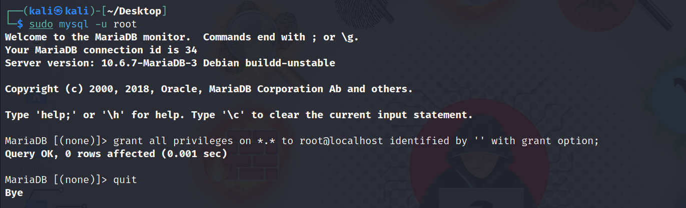

# SQLi Web
Website Containing Different Types of SQL Injection Vulnerabilities

## Lab Preview


## Lab Challenges
- [X] SQL Authentication Bypass - Single Quotes - 1  
- [X] SQL Authentication Bypass - Double Quotes - 2  
- [X] SQL Authentication Bypass - Parenthesis - 3  
- [X] SQL Authentication Bypass - Single Quote Parenthesis - 4  
- [X] SQL Authentication Bypass - No Quotes - 5 
- [X] SQL Authentication Bypass - Double Quote Parenthesis - 6
- [X] SQL Authentication Bypass - Single Quote Double Parenthesis - 7 
- [X] SQL Authentication Bypass - Double Quote Double Parenthesis - 8
- [ ] GET Parameter - Error Based - No Quotes - 1
- [ ] GET Parameter - Error Based - Single Quotes - 2
- [ ] GET Parameter - Error Based - Double Quotes - 3
- [ ] GET Parameter - Error Based - Parenthesis - 4
- [ ] GET Parameter - Error Based - Single Quotes Parenthesis - 5
- [ ] GET Parameter - Error Based - Double Quotes Parenthesis - 6
- [ ] GET Parameter - Error Based - Single Quotes Double Parenthesis - 7
- [ ] GET Parameter - Error Based - Double Quotes Double Parenthesis - 8
- [ ] More labs comming soon

## Different Types of SQLi Vulnerabilities Covered
- Error Based
- Union Based
- Double Query Based
- Blind Boolean Based
- Blind Time Based
- Time Based

## Injection Point of Vulnerabilities
- GET Based Parameter
- POST Based Parameter
- Header Based Parameter
- Cookies Based Parameter

## Lab Setup Instructions

1. Type `sudo mysql -u root` 
2. Enter this command mysql shell: `grant all privileges on *.* to root@localhost identified by '' with grant option;`
3. Type `\q` or `quit` to exit mysql shell



4. Copy & Paste the Command in your linux System
```
sudo rm -r SQLiWeb && sudo rm -r /var/www/html/sqli_challenges && sudo git clone https://github.com/PushpenderIndia/SQLiWeb && sudo mv SQLiWeb/sqli_challenges /var/www/html && sudo rm -r SQLiWeb && sudo service apache2 start && sudo service mysql start && firefox http://127.0.0.1/sqli_challenges/php/db/setup.php &
```

> If you have changed the MYSQL Credentials, You will get error in your browser, after running above command
> Follow below instructions for updating mysql creds

5. Update MySQL Credentials in `db_config.php` file, present in `/var/www/html/sqli_challenges/php/db/`
```
<?php

// Update MySQL DB Credentials
$dbuser  = "root";
$dbpass  = "";

...
...

?>
```

6. By Default `db_creds.php` will have MYSQL Username: `root` & Password: "" (No Password)
7. Run this command to setup Database: `firefox http://127.0.0.1/sqli_challenges/php/db/setup.php &` or simply visit `http://127.0.0.1/sqli_challenges/php/db/setup.php` using web browser.
8. After Setting up the website, it will redirect you to `http://127.0.0.1/sqli_challenges/index.php`
9. Then whenever you want to start website, just run this command: 
```
sudo service apache2 start && sudo service mysql start && firefox http://127.0.0.1/sqli_challenges/index.php &
```

## Writeups
- [User-Agent Header Based - Blind SQLi in Sony: SQLi To RCE](https://hackerone.com/reports/1339430)


